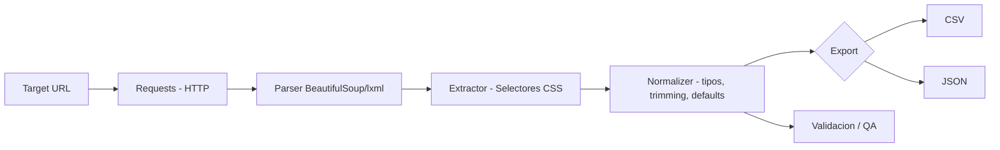

# Plan de Scraping — P1

## 1. Objetivo de negocio

Construir un dataset limpio y validado del catálogo de `books.toscrape.com` (título, precio,
disponibilidad, rating, categoría, imagen y metadatos de detalle) para servir como caso de
portafolio de un pipeline de extracción → normalización → exportación CSV/JSON, reproducible y
documentado de extremo a extremo.

## 2. Fuentes

| Fuente | URL patrón | Contenido |
|---|---|---|
| Listado | `https://books.toscrape.com/catalogue/page-{n}.html` (n=1..50) | 20 tarjetas de producto por página |
| Detalle | `https://books.toscrape.com/catalogue/<slug>_<id>/index.html` | Ficha completa por libro (UPC, precios con/sin impuesto, stock, nº reviews, descripción, categoría) |

## 3. Supuestos

- Los precios y ratings son **aleatorios** (declarado por el propio sitio) — el dataset resultante
  es válido solo como ejercicio técnico, no como fuente de precios reales.
- El catálogo es estático dentro de una sesión de scraping (no cambia entre el minuto 1 y el
  minuto 30 de una corrida).
- 1000 productos / 20 por página = 50 páginas de listado, confirmado en vivo (indicador
  "Page 1 of 50" visible en el sitio).

## 4. Pipeline conceptual

## 5. Responsabilidades por etapa

| Etapa | Responsabilidad | Artefacto relacionado |
|---|---|---|
| Requests (HTTP) | Descargar HTML respetando rate limit, headers, timeouts, reintentos | [onboarding_scraper.md](onboarding_scraper.md) |
| Parser | Convertir HTML a árbol navegable (BeautifulSoup + lxml como parser) | — |
| Extractor | Aplicar el mapa de selectores CSS por campo, con fallback | [selectors_map.md](selectors_map.md) |
| Paginación | Recorrer las 50 páginas de listado + detalle, con checkpoint | [pagination_strategy.md](pagination_strategy.md) |
| Normalizer | Tipar, limpiar, aplicar defaults según el contrato | [data_contract.md](data_contract.md) |
| Export | Serializar a CSV/JSON con encoding y delimitador consistentes | [data_contract.md](data_contract.md) |
| QA | Validar conteos, duplicados, nulos, rangos antes de publicar el dataset | [qa_checklist.md](qa_checklist.md) |

## 6. Observabilidad (conceptual)

- **Logging por request:** nivel (INFO/WARNING/ERROR), timestamp ISO8601, URL, status code,
  intento nº, duración.
- **Logging por registro extraído:** advertencia si algún campo requerido no pudo extraerse
  (selector no encontró nodo) — nunca fallar silenciosamente.
- **Resumen de corrida:** al final, total de páginas visitadas, registros extraídos, registros
  descartados, tiempo total, tasa de error.
- Detalle completo de formato de logs en la fase de "Errores, retries y logs" (ver
  [promptpack.md](promptpack.md), prompt 5).

## 7. Manejo de errores (resumen)

Ver política completa de retries/backoff/circuit breaker en
[onboarding_scraper.md](onboarding_scraper.md) §6. Regla general: cualquier fallo de
extracción de un campo **no required** degrada a `null` con warning; un fallo en un campo
**required** descarta el registro y lo reporta en el resumen de QA.
