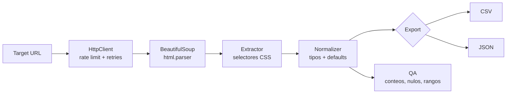

# 📚 founders25-scraper

**Scraper de [books.toscrape.com](https://books.toscrape.com) construido primero como diseño, después como código.**
Proyecto P1 del curso *"Prompting efectivo aplicado a scraping"*: cada línea de este repo
proviene de un artefacto en [`/DOCS`](DOCS/README.md) — nada se improvisó directo en el editor.

[](https://github.com/Rosten1805/founders25-scraper/actions/workflows/tests.yml)


---

## 📖 Tabla de contenidos

- [Qué es esto](#-qué-es-esto)
- [Quickstart](#-quickstart)
- [Cómo funciona (pipeline)](#-cómo-funciona-pipeline)
- [Estructura del repo](#-estructura-del-repo)
- [Uso del CLI](#-uso-del-cli)
- [El dataset (contrato de datos)](#-el-dataset-contrato-de-datos)
- [Tests](#-tests)
- [Diseño: qué se mejoró sobre el repo de referencia](#-diseño-qué-se-mejoró-sobre-el-repo-de-referencia)
- [Artefactos de diseño (/DOCS)](#-artefactos-de-diseño-docs)
- [Roadmap / releases](#-roadmap--releases)
- [Contribuir](#-contribuir)

---

## 🧭 Qué es esto

`books.toscrape.com` es un sandbox público hecho explícitamente para practicar scraping (el
propio sitio lo declara: *"This is a demo website for web scraping purposes"*). Este repo lo
scrapea de punta a punta — listado de 1000 libros en 50 páginas, más ficha de detalle opcional
por producto — y produce un dataset validado en CSV y JSON.

Lo distinto del enfoque: **antes de escribir una sola línea de Python**, se documentó en
[`/DOCS`](DOCS/README.md) el alcance ético (robots.txt, rate limit), el contrato de datos, el
mapa de selectores y la estrategia de paginación. El código es la ejecución literal de esos
documentos — cada módulo referencia el artefacto del que nace.

## 🚀 Quickstart

```bash
git clone https://github.com/Rosten1805/founders25-scraper.git
cd founders25-scraper

python -m venv .venv
.venv\Scripts\Activate.ps1        # Windows PowerShell
# source .venv/bin/activate       # macOS/Linux

pip install -r requirements.txt
pytest -v                          # 24 tests, offline, ~0.4s

python -m scraper.pipeline --pages 50 --output data/books
```

Al terminar tendrás `data/books.csv`, `data/books.json` y `data/books_qa_report.json`.

## 🔄 Cómo funciona (pipeline)



Cada flecha de este diagrama es un módulo real en [`scraper/`](scraper/), no una abstracción —
ver la tabla de estructura abajo.

## 🗂 Estructura del repo

```
scraper/
  config.py            # URLs, selectores CSS, rate limit, timeouts — único lugar a tocar si cambia el DOM
  exceptions.py         # errores tipados (nada de "except Exception" genérico)
  logging_config.py     # logging estructurado: timestamp ISO8601, nivel, request_id
  http_client.py         # requests.Session + retries exponenciales + rate limit + circuit breaker
  extract_listing.py     # parseo de /catalogue/page-{n}.html
  extract_detail.py      # parseo de ficha de producto (lookup por <th>, no posicional)
  normalize.py            # contrato de datos: tipos, defaults, 5 casos límite
  paginate.py              # recorrido de páginas + detección de fin
  checkpoint.py             # reanudación tras interrupción
  export.py                  # CSV/JSON (encoding, delimitador, quoting)
  qa.py                        # conteos, duplicados, nulos, rangos
  pipeline.py                  # CLI que orquesta todo lo anterior
tests/
  fixtures/              # HTML real de books.toscrape.com, guardado para tests offline
  test_extract.py          # 6 tests contra el DOM real
  test_normalize.py         # 18 tests, cubren los 5 casos límite del contrato
DOCS/                        # artefactos de diseño — ver DOCS/README.md
.github/
  workflows/tests.yml         # CI: pytest en cada push/PR
  pull_request_template.md
```

## 🖥 Uso del CLI

```bash
python -m scraper.pipeline [opciones]
```

| Flag | Default | Descripción |
|---|---|---|
| `--pages N` | `50` | Páginas de listado a recorrer (20 libros/página) |
| `--with-detail` | *(off)* | Enriquece cada registro con la ficha de detalle (UPC, impuestos, stock, reviews, descripción, categoría) — más lento (~1.5s/producto) |
| `--output PREFIX` | `data/books` | Prefijo de salida: genera `PREFIX.csv`, `PREFIX.json`, `PREFIX_qa_report.json` |
| `--resume` | *(off)* | Reanuda desde el último checkpoint guardado |
| `--checkpoint PATH` | `data/.checkpoint.json` | Ruta del archivo de checkpoint |
| `--log-file PATH` | *(consola)* | Además de consola, escribe el log a un archivo |

**Ejemplos:**

```bash
# MVP rápido: solo listado, ~50 requests, ~100s
python -m scraper.pipeline --pages 50 --output data/books_listing

# Enriquecido: listado + detalle de las primeras 3 páginas (60 libros), ~2min
python -m scraper.pipeline --pages 3 --with-detail --output data/books_detail_sample

# Reanudar una corrida de 50 páginas interrumpida en la página 30
python -m scraper.pipeline --pages 50 --resume
```

## 📦 El dataset (contrato de datos)

Definido en detalle en [`DOCS/data_contract.md`](DOCS/data_contract.md). Resumen:

```json
{
  "title": "A Light in the Attic",
  "product_url": "https://books.toscrape.com/catalogue/a-light-in-the-attic_1000/index.html",
  "price": 51.77,
  "currency": "GBP",
  "availability": true,
  "rating": 3,
  "category": "Poetry",
  "scraped_at": "2026-08-14T16:06:44Z",
  "upc": "a897fe39b1053632",
  "stock_count": 22,
  "reviews_count": 0,
  "description": "It's hard to imagine a world without A Light in the Attic..."
}
```

`title`, `product_url`, `price`, `currency`, `availability`, `category` y `scraped_at` son
requeridos — su ausencia descarta el registro (nunca lo exporta a medias). El resto son
opcionales con default documentado, incluido `description: null` cuando el sitio no la publica
(caso normal, no un error).

## ✅ Tests

```bash
pytest -v
```

24 tests, **offline** — corren contra HTML real de `books.toscrape.com` guardado en
`tests/fixtures/` (política de cortesía: los tests no generan tráfico al sitio en cada corrida).
Cubren:
- Extracción de listado y detalle contra el DOM real (6 tests)
- Los 5 casos límite del contrato de datos: precio cero, rating no mapeable, descripción
  ausente, disponibilidad atípica, texto con caracteres especiales (18 tests)

CI corre esta misma suite en cada push a `main` — ver el badge arriba.

## 🔧 Diseño: qué se mejoró sobre el repo de referencia

Se tomó como punto de partida conceptual
un proyecto externo de referencia
y se corrigieron deliberadamente sus puntos débiles:

| Repo de referencia | Este proyecto |
|---|---|
| `except Exception` genérico | Excepciones tipadas: `NonRetryableHTTPError`, `RequiredFieldMissingError`, `CircuitBreakerOpenError` |
| Sin reintentos, timeout único de 30s | Retries exponenciales con jitter (2s→32s), timeout conexión/lectura separados |
| Sin delay entre requests | Rate limit de cortesía (1–2s + jitter) en cada request |
| `print()` sin persistir | `logging` estructurado (timestamp ISO8601 + request_id) a consola y archivo |
| Selectores de tabla posicionales (`tr:nth-child`) | Lookup por texto de `<th>` — resiliente a reordenamiento de filas |
| Cero tests | 24 tests `pytest` con fixtures HTML reales |
| Selenium siempre disponible como fallback | No se usa — el sitio es HTML estático, un navegador sería complejidad innecesaria |
| Sin checkpoint/reanudación | `checkpoint.py` guarda progreso por página, soporta `--resume` |
| Sin CI | GitHub Actions corre la suite en cada push/PR |

Un bug real de encoding se encontró y corrigió durante la primera corrida contra el sitio real
(`£` llegaba como `£` por un mal manejo del charset en `requests`) — ver
[`DOCS/changelog.md`](DOCS/changelog.md) para el detalle técnico.

## 📄 Artefactos de diseño (`/DOCS`)

| Artefacto | Contenido |
|---|---|
| [onboarding_scraper.md](DOCS/onboarding_scraper.md) | robots.txt, alcance ético, User-Agent, rate limit |
| [scraping_plan.md](DOCS/scraping_plan.md) | Objetivo, pipeline, responsabilidades |
| [selectors_map.md](DOCS/selectors_map.md) | Selectores CSS verificados contra HTML real |
| [pagination_strategy.md](DOCS/pagination_strategy.md) | Detección de fin, checkpoint, estimaciones |
| [data_contract.md](DOCS/data_contract.md) | Campos, tipos, defaults, casos límite |
| [qa_checklist.md](DOCS/qa_checklist.md) | Validaciones de calidad de datos |
| [dependencias.md](DOCS/dependencias.md) | Librerías, riesgos, decisiones de portabilidad |
| [promptpack.md](DOCS/promptpack.md) | Prompts profesionales reutilizables |

## 🏷 Roadmap / releases

| Tag | Alcance |
|---|---|
| [`v0.1.0`](../../releases/tag/v0.1.0) | Plan — los 9 artefactos de `/DOCS` completos |
| [`v0.2.0`](../../releases/tag/v0.2.0) | Selectores validados + extractor + paginación con checkpoint |
| [`v0.3.0`](../../releases/tag/v0.3.0) | Normalizador + export + QA + pipeline CLI + tests + CI |

Detalle completo del plan de commits y criterios de SemVer en
[`DOCS/changelog.md`](DOCS/changelog.md).

## 🤝 Contribuir

Este repo usa [`.github/pull_request_template.md`](.github/pull_request_template.md)
automáticamente en cada PR. `main` está protegida: los cambios entran por PR, no por push directo.
